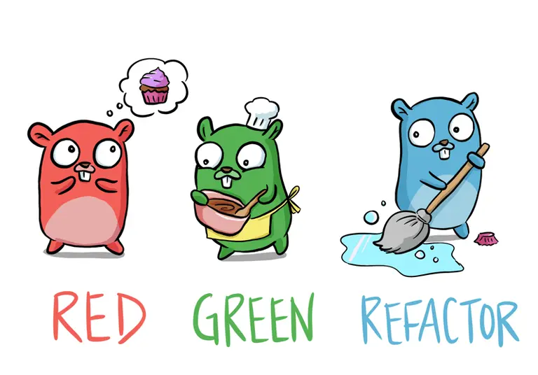

# Learn Go with Tests

This is a collection of [Go](https://golang.org) code examples that show how to write [TDD](https://en.wikipedia.org/wiki/Test-driven_development) tests.

## Progress

1. **Helloworld**: Completed implementation of the [Hello](helloworld/hello.go#L15-L21) function with tests for different languages (English, Spanish, French) and default behavior for empty input.
2. **Integers**: Implemented the [Add](integers/adder.go#L6-L13) function with tests for basic arithmetic operations and logging of results.
   1. **Examples**: Completed implementation of the `ByAge` struct and its methods for sorting a slice of [Person](examples/sort_test.go#L8-L15) structs by age.
3. **Iteration**: Implemented the [Repeat](iteration/repeat.go#L3-L9) function with tests for repeating a character a specified number of times.
4. **Arrays**: Implemented the [Sum](arrays/sum.go#L4-L10) function with tests for basic arithmetic operations and logging of results. And [SumAllTrails](arrays/sum.go#L23-L35) function with tests for basic arithmetic operations and logging of results.
5. **Structs:** Implemented the [Shape interface](structs/shapes.go#L5-L7) and its methods for calculating area and perimeter. Completed implementation of the [Rectangle](structs/shapes.go#L9-L16), [Circle](structs/shapes.go#L18-L24), and [Triangle](structs/shapes.go#L26-L33) structs with tests for their respective methods.
6. **Pointers**: Implemented the [Wallet](pointers/wallet.go) struct with methods for depositing and withdrawing Bitcoin, and tests for basic wallet operations.
7. **Maps**: Implemented the [Dictionary](maps/dictionary.go) struct with methods for adding, deleting, and searching for words, and tests for basic dictionary operations.
8. **Dependency Injection**: Implemented the [Greet](di/di.go#L8-L10) function with tests for basic greeting operations.
9. **Mocking:** Implemented the [Countdown](mocking/countdown.go#L39-L48) function with tests for basic countdown operations.

## Links from the book

- [New module changes in Go 1.16](https://go.dev/blog/go116-module-changes)
  - [Using Go Modules](https://go.dev/blog/using-go-modules)
- [go.mod file reference](https://go.dev/doc/modules/gomod-ref)
- [fmt package](https://pkg.go.dev/fmt#hdr-Printing)
- [Five suggestions for setting up a Go project](https://dave.cheney.net/2014/12/01/five-suggestions-for-setting-up-a-go-project)
- [Testable Examples in Go](https://go.dev/blog/examples)
- [Testing | Benchmarking](https://pkg.go.dev/testing#hdr-Benchmarks)
- [The cover story](https://go.dev/blog/cover)
- [Go Slices: usage and internals](https://go.dev/blog/slices-intro)
  - **Slices examples:**
    - [sample 01](https://go.dev/play/p/ICCWcRGIO68)
    - [sample 02](https://go.dev/play/p/bTrRmYfNYCp)
    - [sample 03](https://go.dev/play/p/Poth8JS28sc)
- [Method declarations](https://go.dev/ref/spec#Method_declarations)
- [Interface types](https://go.dev/ref/spec#Interface_types)
- [Table driven tests](https://go.dev/wiki/TableDrivenTests)
- [Parametric polymorphism](https://en.wikipedia.org/wiki/Parametric_polymorphism)
- [Pointers](https://gobyexample.com/pointers)
- [Struct pointers](https://go.dev/ref/spec#Method_values)
- [Springer](https://pkg.go.dev/fmt#Stringer)
- [Don’t just check errors, handle them gracefully](https://dave.cheney.net/2016/04/27/dont-just-check-errors-handle-them-gracefully)
- [Comparable types](https://golang.org/ref/spec#Comparison_operators)
- [If a map isn’t a reference variable, what is it?](https://dave.cheney.net/2017/04/30/if-a-map-isnt-a-reference-variable-what-is-it)
- [Constant errors](https://dave.cheney.net/2016/04/07/constant-errors)
- [Go Programming Language](https://www.amazon.co.uk/Programming-Language-Addison-Wesley-Professional-Computing/dp/0134190440)
- [Test Double](https://martinfowler.com/bliki/TestDouble.html)
